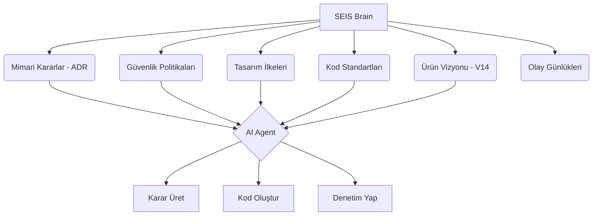

# 🧠 SEIS Brain: Kurumsal Hafıza ve Bilgi Grafiği

## Amaç
SEIS Brain, projenin tüm kararlarını, mimari değişikliklerini, güvenlik politikalarını ve tasarım ilkelerini birleştiren merkezi bilgi grafiğidir. AI ajanlarının bağlamı anlamasını ve tutarlı kararlar almasını sağlar.

## Yapı



## Kullanım Alanları

### 1. AI Ajan Bağlamı
Herhangi bir AI ajanı (Codex, Claude, vb.) kod üretmeden önce SEIS Brain'i sorgular:
- "Bu değişiklik V14 ilkelerine uygun mu?"
- "Daha önce benzer bir mimari karar alındı mı?"
- "Güvenlik standartları nelerdir?"

### 2. Otomatik Dokümantasyon
Yeni bir özellik eklendiğinde, SEIS Brain otomatik olarak:
- İlgili ADR dosyasını oluşturur.
- Güvenlik etkilerini analiz eder.
- Tasarım sistemi ile uyumluluğu kontrol eder.

### 3. Bilgi Grafiği Sorgulama
Örnek sorgular:
- `SELECT * FROM decisions WHERE topic = 'security' AND status = 'approved'`
- `GET /brain/design-principles/apple-first`

## Dosya Yapısı

```
docs/brain/
├── knowledge-graph.json      # Düğümler ve ilişkiler
├── decisions/                # ADR dosyaları
├── policies/                 # Güvenlik ve yönetim kuralları
├── principles/               # Tasarım ve mühendislik ilkeleri
└── events/                   # Önemli olay günlükleri
```

## Entegrasyon

SEIS Brain, şu sistemlerle entegre çalışır:
- **GitHub Actions:** Her PR'da bilgi grafiğini günceller.
- **SEIS-Guardian:** Güvenlik politikalarını buradan çeker.
- **AI Agents:** Kod üretimi için bağlam sağlar.

## Gelecek Planlar

- [ ] GraphQL API ile gerçek zamanlı sorgulama
- [ ] Vector Database ile semantik arama
- [ ] Otomatik ilişki keşfi (ML tabanlı)
- [ ] Zaman yolculuğu (Geçmiş karar versiyonları)

---

*"Bilgi, güçtür. Paylaşılan bilgi, ekosistemdir."* — SEIS V14
