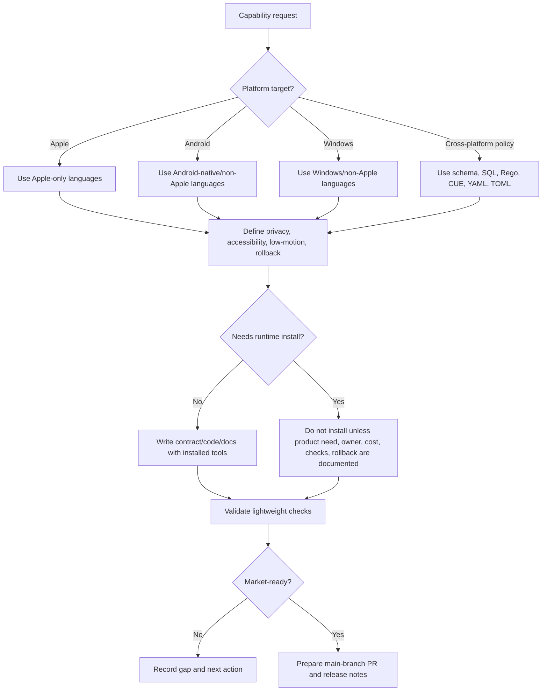

# SEIS Total Capability Operating System

Date: 2026-06-11

This document shifts SEIS toward a capability-first repository surface across engineering, full stack, data, design, development, AI agents, MCP, skills, plugins, LLM routing, algorithms, computer science, web, mobile, games, databases, cloud, cybersecurity, DevOps, testing, architecture, big data, NLP, computer vision, quantum programming, sustainability, low-code/no-code, UX/UI engineering, robotics, AI ethics, compiler and language engineering, requirements, agile delivery, SDLC, metrics, SRE, reverse engineering, refactoring, and formal methods.

The implementation rule is strict for this pass: **do not add new JavaScript or Python application code**. Use existing validation scripts only as checks. Do not install language runtimes only to improve the GitHub language graph.

## One-main Repository Model

SEIS should present `main` as the only canonical public product branch. Historical, assistant, import, experiment, or source branches are treated as archived inputs under `main` documentation, data records, or source snapshots rather than active competing product branches.

| Branch class | Desired state | Rule |
| --- | --- | --- |
| `main` | Canonical product and market surface | All public-ready work converges here after review. |
| Assistant branches | Archived under `main` records | Do not market as separate products. |
| Source/import branches | Preserved as traceable inputs | Keep refs or records only when needed for audit and rollback. |
| Experimental branches | Short-lived | Merge, archive, or delete after decision. |

## Platform Language Focus

| Platform | Priority language families | Avoid for this pass |
| --- | --- | --- |
| Apple | Swift, SwiftUI, Objective-C, Objective-C++, AppleScript, Metal Shading Language, Core ML metadata | JavaScript/Python for native Apple shell work. |
| Android | Kotlin, Java, XML, Gradle metadata, C++, Rust, Go, SQL contracts | Apple-only concepts and new JS/Python code. |
| Windows | C#, F#, PowerShell, Batch, C++, Rust, Go, T-SQL, MSBuild metadata | Apple-only concepts and new JS/Python code. |
| Web | Standards, accessibility contracts, design-system records, progressive enhancement | New JS unless explicitly requested later. |
| Data / AI | SQL, schema, governance records, vector/privacy contracts, model cards | New Python notebooks or services until explicitly requested. |

## Capability Map

| Capability | SEIS direction | First artifact type |
| --- | --- | --- |
| Algorithms and flowcharts | Explainable algorithms with complexity notes and calm failure paths | Mermaid, pseudocode, Swift/Kotlin/C# contracts |
| Mathematics and CS foundations | Complexity, graph, queue, state-machine, constraint, and proof vocabulary | Formal notes, Rego/CUE policies |
| Web development | Accessible, low-motion, progressive, secure interfaces | HTML/CSS/docs/contracts before more JS |
| Mobile development | Native platform shells and emulator/device readiness | Swift/Kotlin policy code |
| Game development | Calm simulation, interaction loops, accessibility, GPU budgets | GLSL/WGSL/engine policy records |
| Data science and AI | Governed datasets, model cards, evals, provenance, privacy | SQL/schema/model governance docs |
| Database management | Migration safety, backups, least privilege, auditability | SQL contracts and ER diagrams |
| Version control | Main-first, signed/traceable commits, small reversible changes | Branch policy and PR gates |
| Cloud computing | Provider-neutral readiness, cost, rollback, least privilege | YAML/TOML/CUE infrastructure records |
| Cybersecurity | Threat modeling, secret hygiene, dependency policy, incident response | SECURITY, Rego gates |
| DevOps and systems | Low-power automation, observable build, safe deploy, rollback | Runbooks, SRE budgets |
| Test engineering | Unit, contract, accessibility, security, smoke, release checks | Check matrix and risk-based suites |
| Architecture and patterns | Modular boundaries, ports/adapters, anti-corruption layers | ADRs and package contracts |
| Big data | Batch/stream ownership, retention, lineage, privacy | SQL/Avro/AsyncAPI schemas |
| NLP and computer vision | Model cards, bias checks, safety filters, dataset provenance | AI governance records |
| Quantum programming | Research-only readiness until business value exists | Q#/math notes |
| Sustainable software | Low-power mode, dependency restraint, carbon/cost awareness | Budget contracts |
| Low-code/no-code | Lovable-first prototype intake, migration-ready exports | Builder intake records |
| UX/UI engineering | Cinematic minimalism, accessibility, reduced motion | Design-system contracts |
| Autonomous vehicles/robotics | Safety-first simulation, sensor provenance, fail-safe constraints | Formal methods and safety cases |
| AI ethics/data governance | Consent, minimization, audit, explainability, human override | Policy records and review gates |
| Compiler/language engineering | DSLs only when they simplify governance or product rules | Grammar notes and typed contracts |
| Requirements/agile/SDLC | Traceable requirements, increments, acceptance checks | Backlog and sprint contracts |
| Metrics and measurement | Meaningful product/quality/SRE metrics, no vanity-only dashboards | KPI/SLO records |
| SRE | Reliability budgets, incident response, observability | SLO/error budget docs |
| Reverse engineering/refactoring | Legal, ethical, traceable analysis; small reversible refactors | Audit notes and diff plans |
| Formal methods | Invariants before broad automation | Rego/CUE/spec contracts |

## Aggressive Build Algorithm

## GitHub Market Readiness

SEIS should be legible as a premium GitHub marketplace-grade repository:

- clear README value proposition and capability map;
- MIT license clarity;
- visible Code of Conduct, Contributing, Security, and Contributors files;
- Codex and Claude attribution as AI development partners;
- main-first branch governance;
- no secret leakage;
- issue/PR templates and release discipline;
- approachable architecture docs;
- high-signal examples in multiple platform languages;
- calm, accessible, sustainable product posture.

## Dependency and Runtime Rule

Do not install every language. Install a language/runtime only when all are true:

1. A real product feature needs it.
2. The target platform owns it.
3. A maintainer can validate it.
4. It has a rollback path.
5. It does not create avoidable thermal, storage, security, or maintenance pressure.

## Immediate Focus

The next SEIS work should prioritize:

1. Main-only repository presentation.
2. Apple-native kernel examples in Swift/Objective-C/AppleScript/Metal when needed.
3. Android/Windows non-Apple capability contracts in Kotlin, Java, C#, F#, PowerShell, SQL, Rego, CUE, YAML, and TOML.
4. AI/Agent/MCP/Skills/Plugin/LLM routing as auditable governance.
5. README, Conduct, Contributing, License, Security, and Contributors readiness for GitHub discovery.
