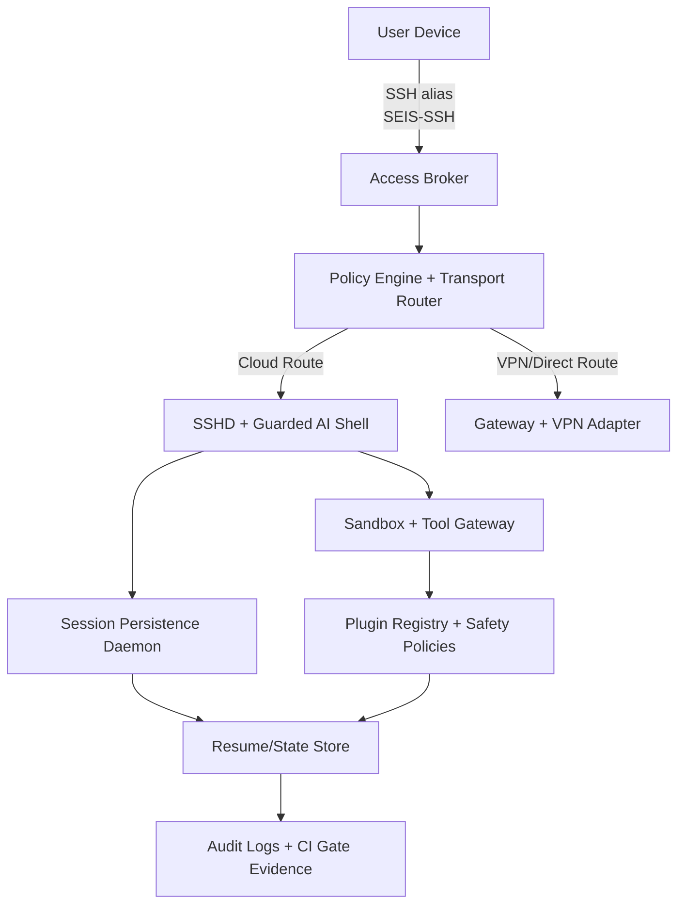

# SEIS SSH: 5 Yıllık Enterprise Blueprint (Apple / Büyük Teknoloji / Büyük AI Perspektifi)

## Amaç
SEIS SSH erişim modelini 5 yıl içinde “çalışır bir PoC”dan, büyük teknoloji firmalarının beklediği seviyede operasyonel olarak sürdürülebilir bir erişim servisine dönüştürmek.

Hedef sabit kalıyor:
- Tek görünür alias: `SEIS-SSH`
- Tek cihaz bağımlılığı olmadan yeni bilgisayarda da hızlıca çevrimiçi kullanım
- Kurumsal güvenlik ve AI yüzeyi için policy-first yaklaşım

Bu belge, ürün tasarımı + güvenlik + operasyon + governance birleşimi olarak hazırlanmıştır.

---

## Resmi Kaynak Bazı

Bu blueprint, şirket isimlerini bir estetik referans olarak değil, resmi ve ölçülebilir güvenlik desenlerine çevirir:

| Kaynak | SEIS SSH karşılığı |
| --- | --- |
| NIST SP 800-207 Zero Trust Architecture | Her SSH isteği kullanıcı, cihaz, kaynak ve risk bağlamıyla değerlendirilir. |
| Apple Managed Device Attestation | Gelecekte cihaz güven durumu erişim kararının bir sinyali olur. |
| Google BeyondCorp | Ağ konumu yerine kimlik, cihaz ve policy erişimi belirler. |
| Microsoft Zero Trust | Kimlik, cihaz, lokasyon, davranış ve risk sinyalleri birlikte değerlendirilir. |
| OpenSSH `sshd_config` / `ForceCommand` | SSH girişi serbest shell değil, kontrollü komut yüzeyi olur. |
| GitHub Enterprise SSH certificate authorities | Uzun ömürlü kişisel key yerine merkezi, iptal edilebilir SSH sertifikaları hedeflenir. |
| AWS Systems Manager Session Manager | 5 yıllık hedefte açık inbound SSH, mümkünse brokered cloud session ile azaltılır. |

Machine-readable kontrat:

```text
deploy/seis-ssh-5-year-enterprise-benchmark.json
```

---

## Büyük Firma Zihniyeti: “Nasıl Yaparlardı?”

### 1) Apple yaklaşımı – “Tek Nokta, Net Deneyim, Güvenli Varsayılanlar”
- Basit, kullanıcıya tek bir giriş noktası bırakır (`SEIS-SSH` benzeri).
- Güvenliği “varsayılan kapalı + güçlü ilk kurulum” ile kurar.
- Gizli bilgiyi yüzeye taşımaz (anahtar/token repo’da olmaz).
- Cihaz değişiminde “kurulum + onay + doğrulama” akışı standartlaştırılır.

### 2) Google yaklaşımı – “Kontrol Codedır”
- Politika ve erişim davranışı kod/manifest ile yönetilir.
- Çalışan her ortamda drift kontrolü zorunlu olur.
- Denetim çıktıları tek tip “proof artifact” olarak saklanır.
- Her kritik adım ölçümle doğrulanır (acceptance gating).

### 3) Büyük AI şirket yaklaşımı (OpenAI/Anthropic vb.)
- SSH erişim yüzeyi bir “AI control plane” gibi ele alınır; sadece onaylı araç çalıştırılır.
- Her kritik araç çağrısı karar etiketi ile loglanır.
- AI asistanının güvenli davranışı için deny-list + kontekst + insan-onayı katmanı vardır.
- Hatalarda hızlı geri alma, session state koruma, tekrar bağlanabilirlik ana odaktır.

### 4) Apple + Google + Büyük AI karşılaştırması

| Boyut | Apple | Google | Büyük AI | SEIS hedefi |
| --- | --- | --- | --- | --- |
| Giriş yüzeyi | Tek ve sade | Kod tabanlı policy | Araç kontrollü | **Tek alias, tek operasyonda tek kaynak** |
| Kimlik | Cihaz+anahtar odaklı | Yetki grafiği | JIT + davranış temelli | **Anahtar-first, kısa ömürlü erişim planı** |
| Dayanıklılık | Hassas restart akışı | Otomatik recovery | Oturum state persist | **Daemon + WebSocket fallback** |
| Denetim | Cihaz/sistem uyumu | Tam audit zinciri | Karar izi ve açıklanabilirlik | **SEIS policy + script + report** |

---

## 5 Yıllık Hedef Modeli (Mimari + Operasyon + AI Yüzeyi)

Her yıl dört katmanda ölçüm yapıyoruz:
1. `Erişim Katmanı` (sshd, alias, pickers)
2. `Kimlik + Politika` (role/claim/deny)
3. `Dayanıklılık + Operasyon` (daemon, observability, rollback)
4. `AI Güvenlik` (araçlar, komut sınırları, insan onayı)

### Yıl 1 – Sağlamlaşan Temel (Enterprise-readiness başlangıcı)
- SSH hardening pratikleri production kaliteye taşınır:
  - `PermitRootLogin no`, `PasswordAuthentication no`, `AllowUsers`/`AllowGroups`
  - `Port 22` + firewall + saldırı yüzeyi azaltma
- `SEIS-SSH` tek görünür alias olarak zorunlu hale gelir.
- `cloud:ssh:online:strict` sadece TCP değil, **`/workspaces/SEIS` + `codex --version` + `git` readiness** ile doğrulanır.
- AI yüzeyinde komut whitelist yaklaşımı netleştirilir.

**KPI hedefleri (Y1):**
- Erişim başarı oranı > %99
- Recovery < 30 sn (bağlantı kopmasından geri dönüş)
- `check:seis-ssh-access-model` fail oranı sıfıra yaklaşır.

### Yıl 2 – Zero Trust + Policy as Code
- Olası yetkisiz davranışlar için deny-first kontroller.
- `authorized_keys` komut kısıtları, kaynak (source) kısıtları ve süre kısıtları uygulanır.
- Riskli komutlar için plugin/AI tool deny-list katmanı genişletilir.
- Yeni cihaz bootstrap süresi sadeleştirilir (tek komutla kurulum + online doğrulama).

**KPI hedefleri (Y2):**
- Yetkisiz komut denemesi < %0.1
- Yeni cihaz onboarding < 5 dk
- 24 saat içinde policy drift raporu.

### Yıl 3 – SRE düzeyi operasyona geçiş
- Multi-az/çoklu cloud erişim hazırlığı (alias değişimi kullanıcıdan soyutlanır).
- Config drift ve rollback testleri preflight’e eklenir.
- `persistence` state imzalanabilir/saklanabilir biçimde sertifika/metadata ile bağlanır.
- CI’de SSH kanıtı olmadan release kapısı olmaz.

**KPI hedefleri (Y3):**
- RTO < 15 dk (restore)
- Config drift tespit doğruluğu > %95
- Her release öncesi SSH gate bypass edilemez.

### Yıl 4 – AI Güvenliği + Olasılık Bazlı Savunma
- AI davranışlarını risk skorlama ile sınıflandırma başlatılır.
- Kritik komut zincirlerinde insan-onayı gereksinimi getirilebilir (policy seviyesi 2/3).
- Anomaliler için otomatik quarantine ve kademeli kilitleme uygulanır.
- SOC/IR için audit pack formatı standardlaştırılır.

**KPI hedefleri (Y4):**
- Kritik alarm yanlış pozitif < %2
- Otomatik müdahale ile oncall tekrarı azalır.
- İlk bağlantı başarılı oranı > %98.

### Yıl 5 – Platform-Grade Erişim Servisi
- SEIS SSH erişimi şirket çapında bir “identity-aware access service” haline gelir.
- Şeffaf ama kontrollü token/peer lifecycle (kısa ömürlü erişim, hızlı rotasyon).
- Bölgesel failover ve self-healing davranışı devreye alınır.
- Geniş ekip kullanımında aynı governance yüzeyi korunur.
- Direct-cloud SSH kalıcı nihai mimari değil, picker uyumluluğu için geçiş yolu olarak kalır.
- Hedef kontrol düzlemi: identity-aware SSH broker + kısa ömürlü SSH sertifikaları + denetimli cloud session.

**KPI hedefleri (Y5):**
- Availability %99.95
- Kritik vaka MTTR < 1 saat
- Bölgesel node ekleme süresi < 30 dk

---

## 90 Günlık Hızlı Olasılık Yol Haritası

**Faz 0 – Zemin Doğrulama (Ay 0–2)**
- `check:seis-ssh-access-model`, `check:ssh-vpn-cloud-server`, `check:seis-ssh-closed-runtime` gate’leri zorunlu olur.
- `SEIS-SSH` dışındaki alias’lar hard-fail kuralına alınır.
- `cloud:ssh:online:strict` çıkışı “online + runtime hazır” olarak raporlanır.

**Faz 1 – Güvenlik ve Dayanıklılık (Ay 2–4)**
- Key + kullanıcı kısıtları `authorized_keys` seviyesinde standardize edilir.
- Daemon/restore davranışı için CI içinde kopma senaryosu eklenir.
- Hatalı alias senaryosu için otomatik düzeltme scripti eklenir.

**Faz 2 – Yönetilebilirlik (Ay 4–6)**
- SSH konfigürasyonları config manifest + script tek noktadan yönetilir.
- Secret yönetimi repo dışına taşınır (`env/secret backend`).
- KPI panosu: RTO/MTTR/roll-back/alias sağlıkları haftalık takip edilir.

**Faz 3 – Ölçek / Şirket Kullanımı (Ay 6–12)**
- Team/organization profili için peer-reviewed VPN kontrolü ve `/32` peer kuralı stabil olur.
- Direct-cloud picker uyumluluğu için otomatik migration + rollback senaryosu eklenir.
- Developer closed-runtime ile uzun oturum yeniden kurtarma testi otomatikleşir.

---

## SEIS İçin 5 Yıl Planını “Şirket Modunda” Uygulama Haritası

1. **Identity + Policy katmanı**
   - `deploy/seis-ssh-access-model.json` alanları şirketin policy as code karşılığıdır.
   - Görünen tek alias `SEIS-SSH` korunur.

2. **Transport + Connectivity katmanı**
   - Kişisel kullanım için cloud-only normal yol.
   - Takım için peer-authenticated VPN.
   - Geliştirici için kapanış ortamı (closed runtime).

3. **AI Command katmanı**
   - `commands.py`, `sandbox.py`, `tools.py` içinde policy-first araç sınırlamaları uygulanır.
   - Kritik kararlar için insan-onayı ve karar etiketi eklenir.

4. **Observability + Incident katmanı**
   - Log bütünlüğü + hata sınıflandırması + rollback evidence zorunlu.
   - CI gate’i olmadan production kabulü yapılmaz.

5. **Device portability katmanı**
- Yeni cihaz için bootstrap script ve doğrulama adımları standardize edilir.
   - Picker uyumluluğu kontrolü, `--require-picker-compatible` standardına alınır.

---

## Risk Atlası (Büyük şirketler nasıl ele alır, biz nasıl uyarlamalıyız)

| Risk | Büyük firmalarda tedavi | SEIS uyarlama |
| --- | --- | --- |
| Lokal alias yeniden belirmesi | Policy drift audit + strict schema checks | `check:seis-ssh-access-model` gate’leri ve görünür alias yasak listesi |
| Secret sızıntısı | Merkezi secret vault + log redaction | repo dışı secret, raporlarda maskelenmiş field |
| Bağlantı kopma sonrası state kaybı | Session persistence + resumable model | `persistence/daemon` + restore testleri |
| Picker ile terminal tutarsızlığı | client-specific transport adapter | direct-cloud fallback migration pipeline |
| AI yanlış eylem | policy-guarded tool calls + deny list | sandbox + tool schema + onaylı komut zinciri |

---

## Ölçüm Çerçevesi (Yıllık kapılar)

- `SLA-SSHD`: `ssh` erişim başarı oranı
- `SLA-DR`: Recovery süresi (RTO)
- `SLA-OR`: Operasyonel geri dönüş süresi (Olay sonrası normalize)
- `SLA-DEC`: Policy drift oranı
- `SLA-AI`: Riskli AI aracı çağrılarında deny/ask/onay oranı

Her çeyrek değerlendirme kriteri:
- Yükselme: tüm kritik KPI’lar hedefe yakınsak.
- Kalma: KPI’lar stabilize ama kritik eşik altında.
- Düşme: iki ardışık dönemde kritik kapılar düşerse yeni özellik durur.

---

## Mevcut Script/Gate Bağlantısı

- Blueprint doğrulama:
  - `npm run check:seis-ssh-access-model`
  - `npm run check:seis-ssh-cloud-roadmap`
  - `npm run check:seis-ssh-closed-runtime`
  - `npm run check:ssh-vpn-cloud-server`
  - `npm run check:seis-ssh-enterprise-benchmark`
  - `npm run cloud:ssh:online:strict`

- Direkt transit gerektiren durumlar:
  - `npm run check:seis-ssh-picker-compatibility`
  - `npm run cloud:ssh:direct-cloud:switch -- --apply`
  - `npm run cloud:ssh-config:install`

---

## Büyük Firma Çıktısı = Büyük SEIS Kararları

`SEIS-SSH` mimarisinin nihai kalite kriteri, bir “özellik listesi” değil, şu 5 şeyi her gün kanıtlayabilmesidir:
1. Her cihazda aynı tek giriş (alias)
2. İzinli ama denetlenebilir AI shell erişimi
3. Offline/yeniden bağlanma sonrası state kaybı olmaması
4. Drift olduğunda rollback ve düzeltme kaydı
5. Yeni bilgisayarda kimlik doğrulama + hazır erişim

Bu 5 kalem tutarlıysa, 5 yıllık hedefin ana omurgası hazırdır.


