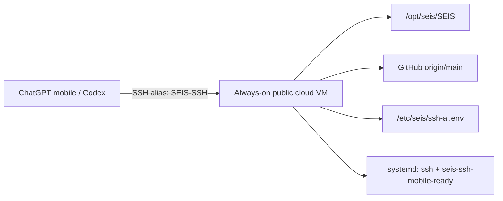

# SEIS SSH Mobile 24x7 Direct Cloud Runbook

This runbook defines the production path for using SEIS from ChatGPT mobile/Codex over SSH without depending on the local Mac.

## Target architecture



## Non-negotiable contract

The machine-readable acceptance contract lives at `content/development/seis-ssh-mobile-direct-cloud-contract.json` and is enforced by `npm run check:seis-ssh-mobile-direct-cloud`.

The acceptance ledger at `content/development/seis-ssh-mobile-direct-cloud-acceptance-ledger.json` defines which command proves each readiness claim. A green governance check alone is not evidence that the cloud VM is reachable.

- Use direct SSH to an always-on cloud VM with a public IP address or DNS name.
- Do not use the local Mac as the 24x7 transport.
- Do not treat GitHub Codespaces as the 24x7 transport; Codespaces can sleep.
- Keep API keys, private SSH keys, tokens, and provider credentials outside git.
- Use root only for bootstrap. Daily mobile/Codex SSH should use `aiuser` or another restricted user.
- Keep the repo on the VM at `/opt/seis/SEIS` unless `SEIS_REPO_DIR` overrides it.

## Local profile generation

Set the cloud endpoint and generate the local profile:

```bash
export SEIS_SSH_HOST="<public-ip-or-dns>"
export SEIS_SSH_USER="aiuser"
export SEIS_SSH_PORT="22"
export SEIS_SSH_IDENTITY_FILE="$HOME/.ssh/id_ed25519_seis_codex"
npm run cloud:ssh:mobile-direct:profile
```

The command writes ignored local reports:

```text
reports/seis-ssh-mobile-direct-cloud-profile.json
reports/seis-ssh-mobile-direct-cloud-profile.md
```

Preview the managed SSH config block:

```bash
npm run cloud:ssh:mobile-direct:config:plan
```

Install the managed `Host SEIS-SSH` block into `~/.ssh/config` only after the preview is correct:

```bash
npm run cloud:ssh:mobile-direct:config:install
```

The installer only writes a marked SEIS-managed block. It refuses to replace an unmanaged `Host SEIS-SSH` alias unless `--force` is passed explicitly.

Probe the direct-cloud endpoint after profile/config installation:

```bash
npm run cloud:ssh:mobile-direct:probe
```

Use the strict probe before claiming ChatGPT mobile/Codex 24x7 readiness:

```bash
npm run cloud:ssh:mobile-direct:probe:strict
```

Produce a reusable doctor handoff report:

```bash
npm run cloud:ssh:mobile-direct:doctor
```

Use the strict doctor in release or mobile-device handoff flows:

```bash
npm run cloud:ssh:mobile-direct:doctor:strict
```

The doctor report includes a machine-readable `claimGate`. It keeps
`readyClaimAllowed`, `continuityClaimAllowed`, and `macOffClaimAllowed` false
unless the strict doctor was requested and the readiness evidence passed. A
non-strict report may help debugging, but it does not authorize the public
mobile 24x7 or Mac-off continuity claim.

## Decision matrix

- Missing `SEIS_SSH_HOST`: blocked. Set the always-on public VM endpoint before claiming readiness.
- Codespaces transport: blocked for 24x7. Use direct-cloud config before mobile handoff.
- Bootstrap plan passed: planned only. It does not prove the VM was changed.
- Config install passed: local client configured only. It does not prove remote runtime readiness.
- Strict probe passed: runtime evidence passed. Run strict doctor to write the handoff report.
- Strict doctor passed: mobile 24x7 ready claim is allowed.

## Mobile handoff checklist

- Confirm `SEIS-SSH` is the only user-facing alias and resolves to direct-cloud SSH without `ProxyCommand`.
- Confirm the always-on public VM endpoint is reachable from the network used by ChatGPT mobile/Codex.
- Confirm SSH key authentication succeeds in batch mode.
- Confirm the remote runtime is online and the SEIS repository is present.
- Confirm `npm run cloud:ssh:mobile-direct:doctor:strict` writes the final readiness report.
- Confirm private keys, API keys, tokens, and runtime secrets remain outside git.
- Confirm a new computer can replay bootstrap/config/probe/doctor commands without copying private runtime state from the old Mac.

## Remote bootstrap

Preview the direct-cloud VM bootstrap command from the local repo:

```bash
export SEIS_SSH_HOST="<public-ip-or-dns>"
export SEIS_SSH_PUBLIC_KEY_FILE="$HOME/.ssh/id_ed25519_seis_codex.pub"
npm run cloud:ssh:mobile-direct:bootstrap:plan
```

Apply it only after the preview is correct and root SSH access is available:

```bash
npm run cloud:ssh:mobile-direct:bootstrap:apply
```

The runner copies `scripts/bootstrap-seis-ssh-mobile-direct-cloud.sh` to `/tmp/seis-bootstrap.sh`, passes the local public key as `SEIS_AUTHORIZED_KEY`, and keeps private keys and API keys out of git and logs.

## Mobile/Codex usage

After bootstrap and SSH config installation:

```bash
ssh SEIS-SSH
seis
git pull --ff-only origin main
npm run cloud:ssh:mobile-24x7:report
npm run cloud:ssh:mobile-direct:probe
npm run cloud:ssh:mobile-direct:doctor
```

The session remains SSH-based. The 24x7 guarantee comes from the always-on VM and systemd-managed SSH service, not from the local computer.

## Secret handling

Store runtime secrets only on the VM:

```text
/etc/seis/ssh-ai.env
```

Never commit:

- `OPENAI_API_KEY`
- private SSH keys
- provider tokens
- `.env` files
- certificates or provisioning files

## Readiness rules

The setup is ready only when all of these are true:

- `SEIS_SSH_HOST` points to a reachable always-on VM.
- Port 22 or the configured SSH port is reachable from the network used by ChatGPT mobile/Codex.
- `SEIS-SSH` uses key-based authentication.
- `/opt/seis/SEIS` exists on the VM and tracks `origin/main`.
- `systemctl status ssh` or `systemctl status sshd` is healthy.
- `systemctl status seis-ssh-mobile-ready` is healthy.
- `npm run cloud:ssh:mobile-24x7:report` no longer reports a Codespaces-only transport blocker.
- `npm run cloud:ssh:mobile-direct:probe:strict` succeeds.
- `npm run cloud:ssh:mobile-direct:doctor:strict` succeeds and writes the handoff report.
- `npm run check:seis-ssh-mobile-direct-cloud` passes against the contract.
- The acceptance ledger maps every ready claim to a concrete command and artifact.

## Fallback policy

If the direct-cloud VM is missing, the correct status is blocked, not ready. Use Codespaces only as temporary development fallback, because it is not a 24x7 SSH substrate.
