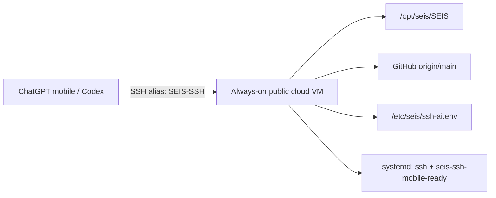

# SEIS SSH Mobile 24x7 Direct Cloud Runbook

This runbook defines the production path for using SEIS from ChatGPT mobile/Codex over SSH without depending on the local Mac.

## Target architecture



## Non-negotiable contract

- Use direct SSH to an always-on cloud VM with a public IP address or DNS name.
- Do not use the local Mac as the 24x7 transport.
- Do not treat GitHub Codespaces as the 24x7 transport; Codespaces can sleep.
- Keep API keys, private SSH keys, tokens, and provider credentials outside git.
- Use root only for bootstrap. Daily mobile/Codex SSH should use `aiuser` or another restricted user.
- Keep the repo on the VM at `/opt/seis/SEIS` unless `SEIS_REPO_DIR` overrides it.

## Local profile generation

Set the cloud endpoint and generate the local profile:

```bash
export SEIS_SSH_HOST="<public-ip-or-dns>"
export SEIS_SSH_USER="aiuser"
export SEIS_SSH_PORT="22"
export SEIS_SSH_IDENTITY_FILE="$HOME/.ssh/id_ed25519_seis_codex"
npm run cloud:ssh:mobile-direct:profile
```

The command writes ignored local reports:

```text
reports/seis-ssh-mobile-direct-cloud-profile.json
reports/seis-ssh-mobile-direct-cloud-profile.md
```

Preview the managed SSH config block:

```bash
npm run cloud:ssh:mobile-direct:config:plan
```

Install the managed `Host SEIS-SSH` block into `~/.ssh/config` only after the preview is correct:

```bash
npm run cloud:ssh:mobile-direct:config:install
```

The installer only writes a marked SEIS-managed block. It refuses to replace an unmanaged `Host SEIS-SSH` alias unless `--force` is passed explicitly.

## Remote bootstrap

Run this once against the direct-cloud VM:

```bash
scp scripts/bootstrap-seis-ssh-mobile-direct-cloud.sh root@<public-ip-or-dns>:/tmp/seis-bootstrap.sh
ssh root@<public-ip-or-dns> 'SEIS_AUTHORIZED_KEY="$(cat ~/.ssh/authorized_keys | tail -n 1)" bash /tmp/seis-bootstrap.sh'
```

For a cleaner local invocation, pass your public key explicitly:

```bash
export SEIS_AUTHORIZED_KEY="$(cat ~/.ssh/id_ed25519_seis_codex.pub)"
ssh root@<public-ip-or-dns> 'bash -s' < scripts/bootstrap-seis-ssh-mobile-direct-cloud.sh
```

## Mobile/Codex usage

After bootstrap and SSH config installation:

```bash
ssh SEIS-SSH
seis
git pull --ff-only origin main
npm run cloud:ssh:mobile-24x7:report
```

The session remains SSH-based. The 24x7 guarantee comes from the always-on VM and systemd-managed SSH service, not from the local computer.

## Secret handling

Store runtime secrets only on the VM:

```text
/etc/seis/ssh-ai.env
```

Never commit:

- `OPENAI_API_KEY`
- private SSH keys
- provider tokens
- `.env` files
- certificates or provisioning files

## Readiness rules

The setup is ready only when all of these are true:

- `SEIS_SSH_HOST` points to a reachable always-on VM.
- Port 22 or the configured SSH port is reachable from the network used by ChatGPT mobile/Codex.
- `SEIS-SSH` uses key-based authentication.
- `/opt/seis/SEIS` exists on the VM and tracks `origin/main`.
- `systemctl status ssh` or `systemctl status sshd` is healthy.
- `systemctl status seis-ssh-mobile-ready` is healthy.
- `npm run cloud:ssh:mobile-24x7:report` no longer reports a Codespaces-only transport blocker.

## Fallback policy

If the direct-cloud VM is missing, the correct status is blocked, not ready. Use Codespaces only as temporary development fallback, because it is not a 24x7 SSH substrate.
