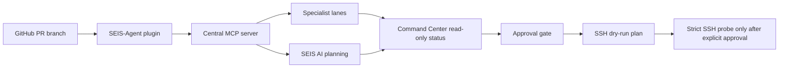

# SEIS Specialist AI MCP SSH Integration

Date: 2026-06-20

This document defines the first safe integration scope for SEIS specialist
plugins, SEIS-Agent, the central MCP server, SEIS AI planning, GitHub
governance, and SSH-controlled remote execution.

The branch for this work is `seis/specialist-ai-mcp-ssh-integration`.

## Scope

This is a foundation and contract slice. It does not create a live SSH
connection, mutate a cloud host, install dependencies, merge old PR branches, or
claim remote readiness.

The durable contract is
[`content/development/seis-specialist-ai-mcp-ssh-integration-contract.json`](../../content/development/seis-specialist-ai-mcp-ssh-integration-contract.json).

## Source Of Truth

| Surface                   | Source                                                           |
| ------------------------- | ---------------------------------------------------------------- |
| Canonical plugin          | `plugins/seis-ai-agent`                                          |
| Specialist lane manifest  | `data/seis-specialist-plugins-2026-06-12.json`                   |
| Central MCP server        | `mcp/seis-mcp-server.mjs`                                        |
| LLM bridge                | `data/seis-repos-llm-bridge-2026-06-08.json`                     |
| SSH direct-cloud contract | `content/development/seis-ssh-mobile-direct-cloud-contract.json` |
| SSH runbook               | `docs/operations/seis-ssh-mobile-24x7.md`                        |

GitHub remains the source of truth. SSH is only an execution plane after
approval and evidence.

## Integration Flow



## Canonical Plugin Rule

`seis-ai-agent@seis-repo` is the only user-facing SEIS plugin card. The
specialist lane directories remain source mirrors, but normal marketplace
publishing stays single-agent:

- SEIS Governance
- SEIS Cloud
- SEIS-Code
- SEIS-Design
- SEIS-DATA

Standalone lane install remains disabled unless a future governance decision
changes the contract.

## MCP Rule

The central MCP server must keep these read-only specialist tools available:

- `seis_specialist_lanes`
- `seis_specialist_lane_status`
- `seis_specialist_lane_plan`

The first integration stage may call status and planning tools only. It must not
execute remote commands, handle credentials, or write SSH configuration.

## SEIS AI Rule

SEIS AI planning surfaces may classify and route work, but they do not create
model ownership claims, execute privileged operations, or approve their own
permission expansion.

The initial AI integration contract is:

- use provider-neutral planning language
- route repository, design, cloud, data, and governance tasks through specialist lanes
- mark SSH/cloud work as blocked until explicit evidence exists
- return planned, blocked, ready, and failed states without inventing readiness

## SSH Rule

Before explicit human approval, SSH remains dry-run only:

- preview profile generation
- preview managed `SEIS-SSH` config
- preview bootstrap command
- verify contract files
- do not connect to a host
- do not mutate `authorized_keys`, firewall, sudo, SSH daemon config, or cloud resources

Live SSH can start only after the user supplies host details, host fingerprint
verification is recorded, public-key authorization is approved, and strict probe
evidence is observed.

## Stage Gates

| Stage                     | Status  | Allowed                                 | Blocked                  |
| ------------------------- | ------- | --------------------------------------- | ------------------------ |
| 0. Foundation             | Current | Docs, contract, validators              | Live SSH, cloud mutation |
| 1. Read-only MCP          | Next    | Status tools, plan tools                | Remote execution         |
| 2. Command Center adapter | Planned | Local status rendering                  | Fake ready states        |
| 3. SSH dry-run            | Planned | Profile/config/bootstrap previews       | Apply commands           |
| 4. Live SSH approval      | Blocked | Strict probe after supplied credentials | Invented host or keys    |

## Validation

Run:

```bash
npm run check:seis-specialist-ai-mcp-ssh-integration
npm run check:seis-specialist-plugins
npm run check:seis-ai-agent
npm run check:seis-ssh-mobile-direct-cloud
npm run check:seis-repos-llm-bridge
npm run seis:check
```

## Not Evidence

These are not enough to claim integration readiness:

- a green governance check alone
- a generated SSH plan without strict probe output
- a plugin manifest that has not been validated
- a qlty status that did not return a current check context
- old PR branches that were not inspected or cleanly extracted

## Next Implementation Order

1. Keep #39 as the canonical old-PR consolidation record.
2. Add this integration contract and validator.
3. Add Command Center read-only status adapters for MCP lane payloads.
4. Add SSH dry-run report surfaces.
5. Request explicit approval before any live SSH or cloud mutation.
