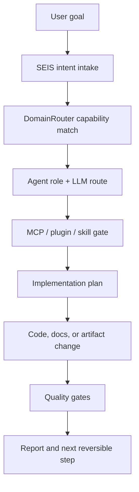

# SEIS Universal Capability Kernel

- Mode: `ai_agent_mcp_skill_plugin_llm_capability_coverage`
- Domains: 38
- Lanes: 14
- Required domains: 38
- Plugin groups: 5
- Plugins inventoried: 154
- Plugins covered by domain routing: 69
- Platform surfaces: 3
- Apple native languages: AppleScript, Objective-C, Playground, Swift, SwiftUI
- Apple frameworks: AppKit, AppleScript, CloudKit, Combine, Core Data, Foundation, Metal, PlaygroundSupport, SwiftUI, UIKit
- Windows native languages: Batch, C, C#, C++, CMD, F#, Go, Java, Kotlin, Lua, PHP, PowerShell, Python, R, Ruby, Rust, SQL, Visual Basic
- Windows frameworks: .NET, WPF, WSL-aware CLI, WinUI, Windows Terminal
- Windows policy language count: 41
- Platform development tracks: 4
- Windows development language coverage: 41

## SEIS Routing Contract

- Entrypoint: `DomainRouter.route(text)`
- SEIS role: SEIS stays the task-facing AI agent; local and remote LLMs become helpers behind scoped routing.
- Execution boundary: No connector, MCP server, plugin, or external model is activated unless task relevance, authentication, permission scope, and user approval are clear.

## Flow

## Lane Coverage

| Lane | Domain Count |
| --- | ---: |
| `ai-intelligence` | 5 |
| `architecture` | 2 |
| `cloud-ops` | 3 |
| `core-computing` | 5 |
| `data-intelligence` | 2 |
| `data-platform` | 2 |
| `design-systems` | 2 |
| `governance` | 3 |
| `interactive-systems` | 1 |
| `product-engineering` | 4 |
| `product-governance` | 3 |
| `quality-engineering` | 2 |
| `research-lab` | 2 |
| `security-governance` | 2 |

## Plugin Group Coverage

| Group | Routed Mentions |
| --- | ---: |
| `design` | 12 |
| `developer-tools` | 70 |
| `external-or-session` | 25 |
| `productivity-ops-business` | 39 |
| `research-finance-legal-science` | 8 |
| `security` | 6 |

## Platform Compatibility

| Platform | Languages | Local Helpers | Quality Gates |
| --- | --- | --- | --- |
| macOS Apple Native | Swift, SwiftUI, Objective-C, Playground, AppleScript | SwiftPM, xcodebuild, xcrun, osascript, osacompile | swift_test, swiftui_playground_surface, objective_c_syntax, applescript_syntax_when_available |
| iOS Apple Native | Swift, SwiftUI, Objective-C | Xcode, xcodebuild, xcrun, simctl | swift_test, swiftui_ios_surface, objective_c_bridge_review, uikit_accessibility |
| Windows Native | Batch, C, C#, C++, CMD, F#, Go, Java, Kotlin, Lua, PHP, PowerShell, Python, R, Ruby, Rust, SQL, Visual Basic | PowerShell, dotnet, winget, python, go, rustc, javac, clang++ | powershell_policy, dotnet_readiness, windows_multilang_source_surface, native_cpp_syntax_when_available |

## Platform Language Policy

- Apple only: AppleScript, Objective-C, Playground, Swift, SwiftUI
- Windows excludes: AppleScript, Objective-C, Playground, Swift, SwiftUI
- Windows allowed count: 41

## Platform Development Tracks

| Track | Platforms | Languages | Rule |
| --- | --- | --- | --- |
| Apple Native Continuation Track | macos, ios | AppleScript, Objective-C, Playground, Swift, SwiftUI | Apple platform work continues through Swift, SwiftUI, Objective-C, Playground, and AppleScript surfaces first. |
| Windows Required Polyglot Track | windows | C#, F#, Visual Basic, PowerShell, Batch, CMD, C, C++, Rust, Go, Python, Java, Kotlin, SQL, R, Lua, Ruby, PHP | Windows work is broad polyglot and must never use Swift, SwiftUI, Objective-C, Playground, or AppleScript surfaces. |
| Windows Extended Polyglot Track | windows | TypeScript, JavaScript, Dart, Scala, Groovy, Haskell, OCaml, Nim, Zig, Fortran, COBOL, Perl, Awk, Tcl, Shell, YAML, JSON Schema, OpenAPI, Terraform, Bicep, Dockerfile, Make, CMake | Extended Windows languages are allowed as needed; JavaScript stays compatibility-only and below the language budget. |
| SEIS Platform Boundary Governance Track | macos, ios, windows | policy-only | SEIS stays primary; platform tracks only constrain safe execution boundaries. |

## Domain Index

| Domain | Lane | Agent Role | Algorithms | Quality Gates |
| --- | --- | --- | --- | --- |
| Algorithms and Flowcharts | `core-computing` | `algorithm-agent` | search, sort, dynamic programming | security, accessibility_when_ui, performance, maintainability |
| Mathematics Foundations | `core-computing` | `math-agent` | optimization, numerical methods, statistical estimation | security, accessibility_when_ui, performance, maintainability |
| Computer Science Foundations | `core-computing` | `cs-foundation-agent` | hashing, queues, trees | security, accessibility_when_ui, performance, maintainability |
| Web Development | `product-engineering` | `web-agent` | event delegation, render scheduling, cache-first loading | security, accessibility_when_ui, performance, maintainability |
| Mobile Development | `product-engineering` | `mobile-agent` | offline sync, gesture state, navigation state | security, accessibility_when_ui, performance, maintainability |
| Game Development | `interactive-systems` | `game-agent` | game loop, collision detection, pathfinding | security, accessibility_when_ui, performance, maintainability |
| Full-Stack Engineering | `product-engineering` | `full-stack-agent` | request routing, validation pipeline, cache invalidation | security, accessibility_when_ui, performance, maintainability |
| Data Engineering and Analytics | `data-intelligence` | `data-agent` | batch processing, incremental models, semantic aggregation | security, accessibility_when_ui, performance, maintainability |
| Data Science | `data-intelligence` | `data-science-agent` | regression, classification, clustering | security, accessibility_when_ui, performance, maintainability |
| Artificial Intelligence | `ai-intelligence` | `ai-agent` | search, planning, retrieval | security, accessibility_when_ui, performance, maintainability |
| AI Agent Engineering | `ai-intelligence` | `agent-orchestrator` | task decomposition, tool routing, policy gating | security, accessibility_when_ui, performance, maintainability |
| LLM Orchestration | `ai-intelligence` | `llm-routing-agent` | provider fallback, intent routing, cost-aware selection | security, accessibility_when_ui, performance, maintainability |
| MCP, Skills, and Plugins | `ai-intelligence` | `integration-agent` | capability matching, permission gating, source synchronization | security, accessibility_when_ui, performance, maintainability |
| Database Management | `data-platform` | `database-agent` | index selection, query planning, migration ordering | security, accessibility_when_ui, performance, maintainability |
| Version Control Systems | `governance` | `git-governance-agent` | diff analysis, merge strategy, release tagging | security, accessibility_when_ui, performance, maintainability |
| Cloud Computing | `cloud-ops` | `cloud-agent` | autoscaling, routing, cache policy | security, accessibility_when_ui, performance, maintainability |
| Cybersecurity | `security-governance` | `security-agent` | attack tree analysis, risk scoring, secret scanning | security, accessibility_when_ui, performance, maintainability |
| DevOps and System Management | `cloud-ops` | `devops-agent` | pipeline orchestration, health checks, rollback sequencing | security, accessibility_when_ui, performance, maintainability |
| Test Engineering | `quality-engineering` | `qa-agent` | property-based testing, mutation testing, snapshot comparison | security, accessibility_when_ui, performance, maintainability |
| Software Architecture and Design Patterns | `architecture` | `architecture-agent` | dependency inversion, event sourcing, adapter patterns | security, accessibility_when_ui, performance, maintainability |
| Big Data Engineering | `data-platform` | `big-data-agent` | partitioning, windowing, map reduce | security, accessibility_when_ui, performance, maintainability |
| NLP and Computer Vision | `ai-intelligence` | `multimodal-ai-agent` | tokenization, embedding search, classification | security, accessibility_when_ui, performance, maintainability |
| Quantum Programming | `research-lab` | `quantum-agent` | grover search, quantum Fourier transform, circuit simulation | security, accessibility_when_ui, performance, maintainability |
| Sustainable Software | `governance` | `sustainability-agent` | resource budgeting, cache reuse, workload shedding | security, accessibility_when_ui, performance, maintainability |
| Low-Code and No-Code Platforms | `product-engineering` | `low-code-agent` | workflow mapping, guardrail validation, export review | security, accessibility_when_ui, performance, maintainability |
| UX and UI Engineering | `design-systems` | `ux-ui-agent` | information architecture, interaction state modeling, responsive heuristics | security, accessibility_when_ui, performance, maintainability |
| Product Design and Creative Systems | `design-systems` | `creative-agent` | creative brief routing, asset curation, variant comparison | security, accessibility_when_ui, performance, maintainability |
| Autonomous Vehicles and Robotics | `research-lab` | `robotics-agent` | path planning, sensor fusion, pid control | security, accessibility_when_ui, performance, maintainability |
| AI Ethics and Data Governance | `governance` | `governance-agent` | risk scoring, bias evaluation, data lineage checks | security, accessibility_when_ui, performance, maintainability |
| Compiler and Language Engineering | `core-computing` | `language-engineering-agent` | lexing, parsing, type checking | security, accessibility_when_ui, performance, maintainability |
| Requirements Engineering | `product-governance` | `requirements-agent` | decision trees, traceability matrices, risk classification | security, accessibility_when_ui, performance, maintainability |
| Agile Project Management | `product-governance` | `delivery-agent` | prioritization scoring, dependency ordering, cycle-time review | security, accessibility_when_ui, performance, maintainability |
| Software Development Lifecycle | `product-governance` | `sdlc-agent` | stage gates, release readiness, retirement planning | security, accessibility_when_ui, performance, maintainability |
| Software Metrics and Measurement | `quality-engineering` | `metrics-agent` | aggregation, trend analysis, threshold checks | security, accessibility_when_ui, performance, maintainability |
| SRE and Observability | `cloud-ops` | `sre-agent` | error budget policy, alert routing, incident timeline analysis | security, accessibility_when_ui, performance, maintainability |
| Reverse Engineering | `security-governance` | `reverse-engineering-agent` | static analysis, call graph extraction, behavior comparison | security, accessibility_when_ui, performance, maintainability |
| Software Refactoring | `architecture` | `refactoring-agent` | dependency extraction, strangler pattern, behavior characterization | security, accessibility_when_ui, performance, maintainability |
| Formal Methods | `core-computing` | `formal-methods-agent` | model checking, symbolic execution, contract verification | security, accessibility_when_ui, performance, maintainability |

## Source References

- `kernelCode`: `packages/seis_kernel/capabilities.py`
- `polyglotManifest`: `polyglot/manifest.json`
- `llmRoutingPolicy`: `content/development/llm-task-routing-policy.json`
- `pluginSources`: `deploy/cloud-environment.json`
